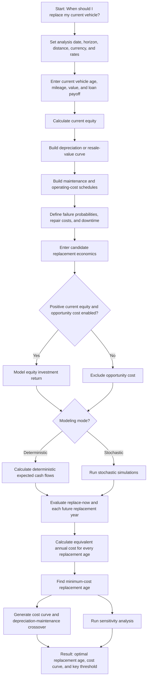

# Story 1: Optimal replacement timing flowchart

[Back to diagram index](../flow-diagrams.md)

```mermaid
flowchart TD
  S1A["Start: When should I replace my current vehicle?"]
  S1B["Set analysis date, horizon, distance, currency, and rates"]
  S1C["Enter current vehicle age, mileage, value, and loan payoff"]
  S1D["Calculate current equity"]
  S1E["Build depreciation or resale-value curve"]
  S1F["Build maintenance and operating-cost schedules"]
  S1G["Define failure probabilities, repair costs, and downtime"]
  S1H["Enter candidate replacement economics"]
  S1I{"Positive current equity and opportunity cost enabled?"}
  S1J["Model equity investment return"]
  S1K["Exclude opportunity cost"]
  S1L{"Modeling mode?"}
  S1M["Calculate deterministic expected cash flows"]
  S1N["Run stochastic simulations"]
  S1O["Evaluate replace-now and each future replacement year"]
  S1P["Calculate equivalent annual cost for every replacement age"]
  S1Q["Find minimum-cost replacement age"]
  S1R["Generate cost curve and depreciation-maintenance crossover"]
  S1T["Run sensitivity analysis"]
  S1U["Result: optimal replacement age, cost curve, and key threshold"]

  S1A --> S1B --> S1C --> S1D --> S1E --> S1F --> S1G --> S1H --> S1I
  S1I -->|Yes| S1J --> S1L
  S1I -->|No| S1K --> S1L
  S1L -->|Deterministic| S1M --> S1O
  S1L -->|Stochastic| S1N --> S1O
  S1O --> S1P --> S1Q
  S1Q --> S1R
  S1Q --> S1T
  S1R --> S1U
  S1T --> S1U
```
