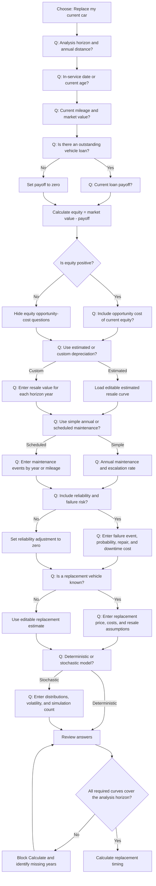

# Story 1: Optimal replacement timing questionnaire

[Back to diagram index](../flow-diagrams.md)

```mermaid
flowchart TD
  Q1A["Choose: Replace my current car"]
  Q1B["Q: Analysis horizon and annual distance?"]
  Q1C["Q: In-service date or current age?"]
  Q1D["Q: Current mileage and market value?"]
  Q1E["Q: Is there an outstanding vehicle loan?"]
  Q1F["Q: Current loan payoff?"]
  Q1G["Set payoff to zero"]
  Q1H["Calculate equity = market value - payoff"]
  Q1I{"Is equity positive?"}
  Q1J["Q: Include opportunity cost of current equity?"]
  Q1K["Hide equity opportunity-cost questions"]
  Q1L["Q: Use estimated or custom depreciation?"]
  Q1M["Load editable estimated resale curve"]
  Q1N["Q: Enter resale value for each horizon year"]
  Q1O["Q: Use simple annual or scheduled maintenance?"]
  Q1P["Q: Annual maintenance and escalation rate"]
  Q1Q["Q: Enter maintenance events by year or mileage"]
  Q1R["Q: Include reliability and failure risk?"]
  Q1S["Q: Enter failure event, probability, repair, and downtime cost"]
  Q1T["Set reliability adjustment to zero"]
  Q1U["Q: Is a replacement vehicle known?"]
  Q1V["Q: Enter replacement price, costs, and resale assumptions"]
  Q1W["Use editable replacement estimate"]
  Q1X["Q: Deterministic or stochastic model?"]
  Q1Y["Q: Enter distributions, volatility, and simulation count"]
  Q1Z["Review answers"]
  Q1BLOCK{"All required curves cover the analysis horizon?"}
  Q1FIX["Block Calculate and identify missing years"]
  Q1CALC["Calculate replacement timing"]

  Q1A --> Q1B --> Q1C --> Q1D --> Q1E
  Q1E -->|Yes| Q1F --> Q1H
  Q1E -->|No| Q1G --> Q1H
  Q1H --> Q1I
  Q1I -->|Yes| Q1J --> Q1L
  Q1I -->|No| Q1K --> Q1L
  Q1L -->|Estimated| Q1M --> Q1O
  Q1L -->|Custom| Q1N --> Q1O
  Q1O -->|Simple| Q1P --> Q1R
  Q1O -->|Scheduled| Q1Q --> Q1R
  Q1R -->|Yes| Q1S --> Q1U
  Q1R -->|No| Q1T --> Q1U
  Q1U -->|Yes| Q1V --> Q1X
  Q1U -->|No| Q1W --> Q1X
  Q1X -->|Deterministic| Q1Z
  Q1X -->|Stochastic| Q1Y --> Q1Z
  Q1Z --> Q1BLOCK
  Q1BLOCK -->|No| Q1FIX --> Q1Z
  Q1BLOCK -->|Yes| Q1CALC
```
