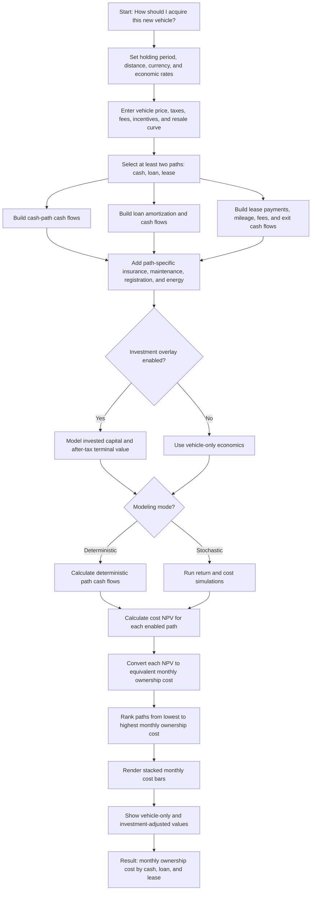

# Story 2A: New-car acquisition flowchart

[Back to diagram index](../flow-diagrams.md)

```mermaid
flowchart TD
  S2AA["Start: How should I acquire this new vehicle?"]
  S2AB["Set holding period, distance, currency, and economic rates"]
  S2AC["Enter vehicle price, taxes, fees, incentives, and resale curve"]
  S2AD["Select at least two paths: cash, loan, lease"]
  S2AE["Build cash-path cash flows"]
  S2AF["Build loan amortization and cash flows"]
  S2AG["Build lease payments, mileage, fees, and exit cash flows"]
  S2AH["Add path-specific insurance, maintenance, registration, and energy"]
  S2AI{"Investment overlay enabled?"}
  S2AJ["Model invested capital and after-tax terminal value"]
  S2AK["Use vehicle-only economics"]
  S2AL{"Modeling mode?"}
  S2AM["Calculate deterministic path cash flows"]
  S2AN["Run return and cost simulations"]
  S2AO["Calculate cost NPV for each enabled path"]
  S2AP["Convert each NPV to equivalent monthly ownership cost"]
  S2AQ["Rank paths from lowest to highest monthly ownership cost"]
  S2AR["Render stacked monthly cost bars"]
  S2AS["Show vehicle-only and investment-adjusted values"]
  S2AT["Result: monthly ownership cost by cash, loan, and lease"]

  S2AA --> S2AB --> S2AC --> S2AD
  S2AD --> S2AE
  S2AD --> S2AF
  S2AD --> S2AG
  S2AE --> S2AH
  S2AF --> S2AH
  S2AG --> S2AH
  S2AH --> S2AI
  S2AI -->|Yes| S2AJ --> S2AL
  S2AI -->|No| S2AK --> S2AL
  S2AL -->|Deterministic| S2AM --> S2AO
  S2AL -->|Stochastic| S2AN --> S2AO
  S2AO --> S2AP --> S2AQ --> S2AR --> S2AS --> S2AT
```
