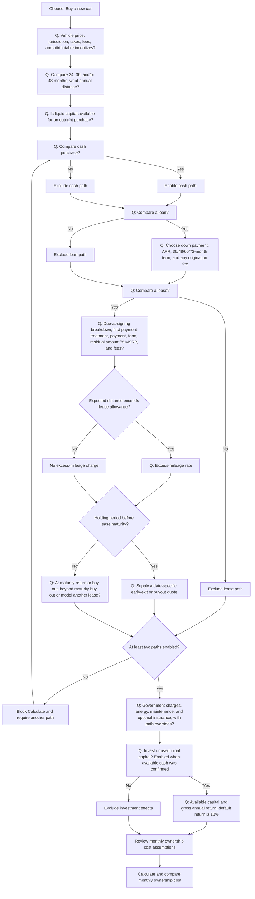

# Story 2A: New-car acquisition questionnaire

[Back to diagram index](../flow-diagrams.md)

```mermaid
flowchart TD
  Q2AA["Choose: Buy a new car"]
  Q2AB["Q: Vehicle price, jurisdiction, taxes, fees, and attributable incentives?"]
  Q2AC["Q: Compare 24, 36, and/or 48 months; what annual distance?"]
  Q2AC2["Q: Is liquid capital available for an outright purchase?"]
  Q2AD["Q: Compare cash purchase?"]
  Q2AE["Enable cash path"]
  Q2AF["Exclude cash path"]
  Q2AG["Q: Compare a loan?"]
  Q2AH["Q: Choose down payment, APR, 36/48/60/72-month term, and any origination fee"]
  Q2AI["Exclude loan path"]
  Q2AJ["Q: Compare a lease?"]
  Q2AK["Q: Due-at-signing breakdown, first-payment treatment, payment, term, residual amount/% MSRP, and fees?"]
  Q2AL{"Expected distance exceeds lease allowance?"}
  Q2AM["Q: Excess-mileage rate"]
  Q2AN["No excess-mileage charge"]
  Q2AO{"Holding period before lease maturity?"}
  Q2AP["Q: Supply a date-specific early-exit or buyout quote"]
  Q2AP2["Q: At maturity return or buy out; beyond maturity buy out or model another lease?"]
  Q2AQ["Exclude lease path"]
  Q2AR{"At least two paths enabled?"}
  Q2AS["Block Calculate and require another path"]
  Q2AT["Q: Government charges, energy, maintenance, and optional insurance, with path overrides?"]
  Q2AU["Q: Invest unused initial capital? Enabled when available cash was confirmed"]
  Q2AV["Q: Available capital and gross annual return; default return is 10%"]
  Q2AW["Exclude investment effects"]
  Q2AZ["Review monthly ownership cost assumptions"]
  Q2CALC["Calculate and compare monthly ownership cost"]

  Q2AA --> Q2AB --> Q2AC --> Q2AC2 --> Q2AD
  Q2AD -->|Yes| Q2AE --> Q2AG
  Q2AD -->|No| Q2AF --> Q2AG
  Q2AG -->|Yes| Q2AH --> Q2AJ
  Q2AG -->|No| Q2AI --> Q2AJ
  Q2AJ -->|Yes| Q2AK --> Q2AL
  Q2AJ -->|No| Q2AQ --> Q2AR
  Q2AL -->|Yes| Q2AM --> Q2AO
  Q2AL -->|No| Q2AN --> Q2AO
  Q2AO -->|Yes| Q2AP --> Q2AR
  Q2AO -->|No| Q2AP2 --> Q2AR
  Q2AR -->|No| Q2AS --> Q2AD
  Q2AR -->|Yes| Q2AT --> Q2AU
  Q2AU -->|Yes| Q2AV --> Q2AZ
  Q2AU -->|No| Q2AW --> Q2AZ
  Q2AZ --> Q2CALC
```
