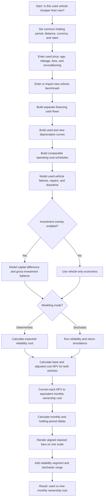

# Story 2B: Used-versus-new flowchart

[Back to diagram index](../flow-diagrams.md)

```mermaid
flowchart TD
  S2BA["Start: Is this used vehicle cheaper than new?"]
  S2BB["Set common holding period, distance, currency, and rates"]
  S2BC["Enter used price, age, mileage, fees, and reconditioning"]
  S2BD["Enter or import new-vehicle benchmark"]
  S2BE["Build separate financing cash flows"]
  S2BF["Build used and new depreciation curves"]
  S2BG["Build comparable operating-cost schedules"]
  S2BH["Model used-vehicle failures, repairs, and downtime"]
  S2BI{"Investment overlay enabled?"}
  S2BJ["Model capital difference and gross investment balance"]
  S2BK["Use vehicle-only economics"]
  S2BL{"Modeling mode?"}
  S2BM["Calculate expected reliability cost"]
  S2BN["Run reliability and return simulations"]
  S2BO["Calculate base and adjusted cost NPV for both vehicles"]
  S2BP["Convert each NPV to equivalent monthly ownership cost"]
  S2BQ["Calculate monthly and holding-period deltas"]
  S2BR["Render aligned stacked bars on one scale"]
  S2BS["Add reliability segment and stochastic range"]
  S2BT["Result: used vs new monthly ownership cost"]

  S2BA --> S2BB --> S2BC --> S2BD --> S2BE --> S2BF --> S2BG --> S2BH --> S2BI
  S2BI -->|Yes| S2BJ --> S2BL
  S2BI -->|No| S2BK --> S2BL
  S2BL -->|Deterministic| S2BM --> S2BO
  S2BL -->|Stochastic| S2BN --> S2BO
  S2BO --> S2BP --> S2BQ --> S2BR --> S2BS --> S2BT
```
