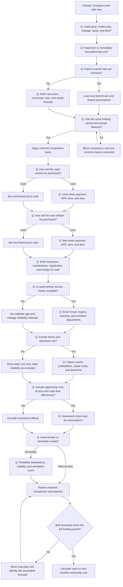

# Story 2B: Used-versus-new questionnaire

[Back to diagram index](../flow-diagrams.md)

```mermaid
flowchart TD
  Q2BA["Choose: Compare used with new"]
  Q2BB["Q: Used price, model year, mileage, taxes, and fees?"]
  Q2BC["Q: Inspection or immediate reconditioning cost?"]
  Q2BD["Q: Import a saved new-car scenario?"]
  Q2BE["Load new benchmark and shared assumptions"]
  Q2BF["Q: Enter new price, incentives, fees, and resale forecast"]
  Q2BG["Q: Use the same holding period and annual distance?"]
  Q2BH["Apply common comparison basis"]
  Q2BI["Block comparison until one common basis is selected"]
  Q2BJ["Q: How will the used vehicle be purchased?"]
  Q2BK["Q: Used down payment, APR, term, and fees"]
  Q2BL["Set used financing to cash"]
  Q2BM["Q: How will the new vehicle be purchased?"]
  Q2BN["Q: New down payment, APR, term, and fees"]
  Q2BO["Set new financing to cash"]
  Q2BP["Q: Enter insurance, maintenance, registration, and energy for each"]
  Q2BQ["Q: Is used-vehicle service history available?"]
  Q2BR["Q: Enter known repairs, warranty, and condition adjustments"]
  Q2BS["Use editable age-and-mileage reliability estimate"]
  Q2BT["Q: Include failure and downtime risk?"]
  Q2BU["Q: Failure events, probabilities, repair costs, and downtime"]
  Q2BV["Show base cost only; label reliability as excluded"]
  Q2BW["Q: Include opportunity cost of price and cash-flow differences?"]
  Q2BX["Q: Investment return and tax assumptions"]
  Q2BY["Exclude investment effects"]
  Q2BZ["Q: Deterministic or stochastic model?"]
  Q2BZA["Q: Reliability distributions, volatility, and simulation count"]
  Q2BZB["Review matched comparison assumptions"]
  Q2BLOCK{"Both forecasts cover the full holding period?"}
  Q2FIX["Block Calculate and identify the incomplete forecast"]
  Q2CALC["Calculate used vs new monthly ownership cost"]

  Q2BA --> Q2BB --> Q2BC --> Q2BD
  Q2BD -->|Yes| Q2BE --> Q2BG
  Q2BD -->|No| Q2BF --> Q2BG
  Q2BG -->|Yes| Q2BH --> Q2BJ
  Q2BG -->|No| Q2BI --> Q2BG
  Q2BJ -->|Loan| Q2BK --> Q2BM
  Q2BJ -->|Cash| Q2BL --> Q2BM
  Q2BM -->|Loan| Q2BN --> Q2BP
  Q2BM -->|Cash| Q2BO --> Q2BP
  Q2BP --> Q2BQ
  Q2BQ -->|Yes| Q2BR --> Q2BT
  Q2BQ -->|No| Q2BS --> Q2BT
  Q2BT -->|Yes| Q2BU --> Q2BW
  Q2BT -->|No| Q2BV --> Q2BW
  Q2BW -->|Yes| Q2BX --> Q2BZ
  Q2BW -->|No| Q2BY --> Q2BZ
  Q2BZ -->|Deterministic| Q2BZB
  Q2BZ -->|Stochastic| Q2BZA --> Q2BZB
  Q2BZB --> Q2BLOCK
  Q2BLOCK -->|No| Q2FIX --> Q2BZB
  Q2BLOCK -->|Yes| Q2CALC
```
