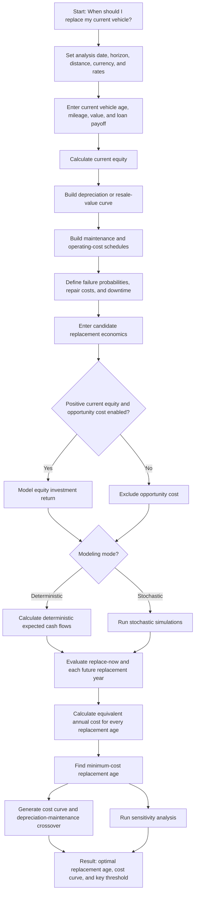
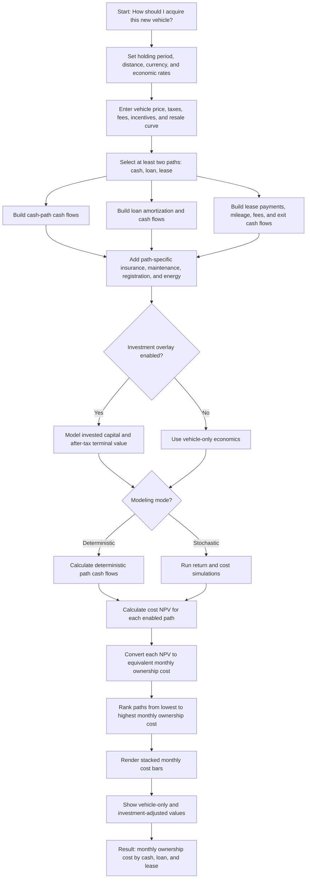
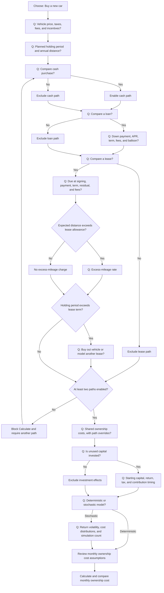
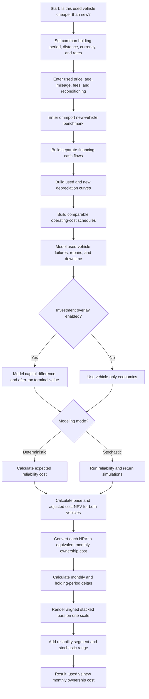

# Flowcharts and questionnaire logic

This document contains six separate diagrams:

1. Story 1 end-to-end flowchart.
2. Story 1 questionnaire logic.
3. Story 2A end-to-end flowchart.
4. Story 2A questionnaire logic.
5. Story 2B end-to-end flowchart.
6. Story 2B questionnaire logic.

The **flowcharts** describe calculation and result generation. The
**questionnaire diagrams** describe which questions appear, which answers
change the path, and which conditions block calculation.

## Story 1: Optimal replacement timing

### Flowchart 1: End-to-end calculation

### Questionnaire logic 1

```mermaid
flowchart TD
  Q1A["Choose: Replace my current car"]
  Q1B["Q: Analysis horizon and annual distance?"]
  Q1C["Q: In-service date or current age?"]
  Q1D["Q: Current mileage and market value?"]
  Q1E["Q: Is there an outstanding vehicle loan?"]
  Q1F["Q: Current loan payoff?"]
  Q1G["Set payoff to zero"]
  Q1H["Calculate equity = market value - payoff"]
  Q1I{"Is equity positive?"}
  Q1J["Q: Include opportunity cost of current equity?"]
  Q1K["Hide equity opportunity-cost questions"]
  Q1L["Q: Use estimated or custom depreciation?"]
  Q1M["Load editable estimated resale curve"]
  Q1N["Q: Enter resale value for each horizon year"]
  Q1O["Q: Use simple annual or scheduled maintenance?"]
  Q1P["Q: Annual maintenance and escalation rate"]
  Q1Q["Q: Enter maintenance events by year or mileage"]
  Q1R["Q: Include reliability and failure risk?"]
  Q1S["Q: Enter failure event, probability, repair, and downtime cost"]
  Q1T["Set reliability adjustment to zero"]
  Q1U["Q: Is a replacement vehicle known?"]
  Q1V["Q: Enter replacement price, costs, and resale assumptions"]
  Q1W["Use editable replacement estimate"]
  Q1X["Q: Deterministic or stochastic model?"]
  Q1Y["Q: Enter distributions, volatility, and simulation count"]
  Q1Z["Review answers"]
  Q1BLOCK{"All required curves cover the analysis horizon?"}
  Q1FIX["Block Calculate and identify missing years"]
  Q1CALC["Calculate replacement timing"]

  Q1A --> Q1B --> Q1C --> Q1D --> Q1E
  Q1E -->|Yes| Q1F --> Q1H
  Q1E -->|No| Q1G --> Q1H
  Q1H --> Q1I
  Q1I -->|Yes| Q1J --> Q1L
  Q1I -->|No| Q1K --> Q1L
  Q1L -->|Estimated| Q1M --> Q1O
  Q1L -->|Custom| Q1N --> Q1O
  Q1O -->|Simple| Q1P --> Q1R
  Q1O -->|Scheduled| Q1Q --> Q1R
  Q1R -->|Yes| Q1S --> Q1U
  Q1R -->|No| Q1T --> Q1U
  Q1U -->|Yes| Q1V --> Q1X
  Q1U -->|No| Q1W --> Q1X
  Q1X -->|Deterministic| Q1Z
  Q1X -->|Stochastic| Q1Y --> Q1Z
  Q1Z --> Q1BLOCK
  Q1BLOCK -->|No| Q1FIX --> Q1Z
  Q1BLOCK -->|Yes| Q1CALC
```

## Story 2A: Buying a new car

### Flowchart 2: End-to-end calculation

### Questionnaire logic 2

## Story 2B: Buying a used car and comparing it with new

### Flowchart 3: End-to-end calculation

### Questionnaire logic 3

```mermaid
flowchart TD
  Q2BA["Choose: Compare used with new"]
  Q2BB["Q: Used price, model year, mileage, taxes, and fees?"]
  Q2BC["Q: Inspection or immediate reconditioning cost?"]
  Q2BD["Q: Import a saved new-car scenario?"]
  Q2BE["Load new benchmark and shared assumptions"]
  Q2BF["Q: Enter new price, incentives, fees, and resale forecast"]
  Q2BG["Q: Use the same holding period and annual distance?"]
  Q2BH["Apply common comparison basis"]
  Q2BI["Block comparison until one common basis is selected"]
  Q2BJ["Q: How will the used vehicle be purchased?"]
  Q2BK["Q: Used down payment, APR, term, and fees"]
  Q2BL["Set used financing to cash"]
  Q2BM["Q: How will the new vehicle be purchased?"]
  Q2BN["Q: New down payment, APR, term, and fees"]
  Q2BO["Set new financing to cash"]
  Q2BP["Q: Enter insurance, maintenance, registration, and energy for each"]
  Q2BQ["Q: Is used-vehicle service history available?"]
  Q2BR["Q: Enter known repairs, warranty, and condition adjustments"]
  Q2BS["Use editable age-and-mileage reliability estimate"]
  Q2BT["Q: Include failure and downtime risk?"]
  Q2BU["Q: Failure events, probabilities, repair costs, and downtime"]
  Q2BV["Show base cost only; label reliability as excluded"]
  Q2BW["Q: Include opportunity cost of price and cash-flow differences?"]
  Q2BX["Q: Investment return and tax assumptions"]
  Q2BY["Exclude investment effects"]
  Q2BZ["Q: Deterministic or stochastic model?"]
  Q2BZA["Q: Reliability distributions, volatility, and simulation count"]
  Q2BZB["Review matched comparison assumptions"]
  Q2BLOCK{"Both forecasts cover the full holding period?"}
  Q2FIX["Block Calculate and identify the incomplete forecast"]
  Q2CALC["Calculate used vs new monthly ownership cost"]

  Q2BA --> Q2BB --> Q2BC --> Q2BD
  Q2BD -->|Yes| Q2BE --> Q2BG
  Q2BD -->|No| Q2BF --> Q2BG
  Q2BG -->|Yes| Q2BH --> Q2BJ
  Q2BG -->|No| Q2BI --> Q2BG
  Q2BJ -->|Loan| Q2BK --> Q2BM
  Q2BJ -->|Cash| Q2BL --> Q2BM
  Q2BM -->|Loan| Q2BN --> Q2BP
  Q2BM -->|Cash| Q2BO --> Q2BP
  Q2BP --> Q2BQ
  Q2BQ -->|Yes| Q2BR --> Q2BT
  Q2BQ -->|No| Q2BS --> Q2BT
  Q2BT -->|Yes| Q2BU --> Q2BW
  Q2BT -->|No| Q2BV --> Q2BW
  Q2BW -->|Yes| Q2BX --> Q2BZ
  Q2BW -->|No| Q2BY --> Q2BZ
  Q2BZ -->|Deterministic| Q2BZB
  Q2BZ -->|Stochastic| Q2BZA --> Q2BZB
  Q2BZB --> Q2BLOCK
  Q2BLOCK -->|No| Q2FIX --> Q2BZB
  Q2BLOCK -->|Yes| Q2CALC
```

## Diagram implementation rules

- Every question node maps to one form section or field group.
- A `No` answer must either skip irrelevant fields or identify an explicit
  exclusion in the review screen.
- Blocking nodes prevent calculation and link back to the unresolved question.
- Loaded estimates remain editable and display their source and effective date.
- All paths converge on a review step before calculation.
- Stories 2A and 2B always terminate in a visual monthly ownership-cost
  comparison; NPV remains supporting detail.
