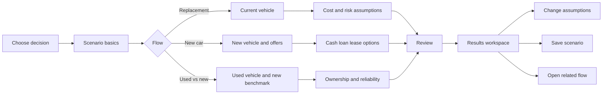

# Multi-flow product concept and provisional UI requirements

## Project purpose and design status

Cardec is planned as a web-based application with a graphical user interface.
The application will collect vehicle and financial assumptions, run
deterministic or stochastic calculations, and visually explain the resulting
ownership economics.

The project is currently in the **calculation and statistical validation
phase**. This document defines the information, decisions, outputs, and
traceability that a future UI must support. It does not select a final page
layout, component library, visual style, navigation pattern, or control set.

Work proceeds through explicit stage gates:

| Stage | Goal | Exit condition |
| --- | --- | --- |
| 1. Deterministic validation | Prove formulas, cash-flow timing, depreciation, financing, maintenance, and terminal values | Benchmark scenarios reconcile to independently calculated expected values |
| 2. Statistical validation | Prove reliability, distributions, simulations, percentiles, and sensitivity behavior | Fixed-seed tests are repeatable and simulated results match analytical expectations where available |
| 3. Model stabilization | Finalize input definitions, output metrics, exclusions, and decision thresholds | Every result is traceable to versioned inputs and documented formulas |
| 4. UI exploration | Compare ways to present questions, controls, assumptions, and visual results | A UI direction is selected through scenario-based review |
| 5. Web implementation | Build the selected responsive and accessible interface | End-to-end user flows reproduce validated model results |

Until Stages 1-3 are complete, UI statements below are requirements or
hypotheses to test, not settled implementation decisions.

## 1. Product decision

The current product hypothesis is one scenario workspace with three goal-based
entry points. The future UI should avoid one undifferentiated vehicle form.
Each flow should ask only for inputs that can change its result while retaining
shared assumptions when the user switches or compares flows. This hypothesis
will be reviewed during UI exploration.

| Entry point | User decision | Primary result |
| --- | --- | --- |
| Replace my current car | "Keep it or replace it, and when?" | Optimal replacement age |
| Buy a new car | "Cash, loan, or lease?" | Monthly ownership cost by path |
| Compare used with new | "Is this used car actually cheaper?" | Monthly ownership cost: used vs new |

## 2. Provisional navigation model

Detailed end-to-end flowcharts and conditional question paths for all three
stories are defined in [Flowcharts and questionnaire logic](flow-diagrams.md).



A candidate web UI may use a persistent workspace header containing scenario
name, currency, save status, and a `Change decision` action. A stepper may show
only the active flow's steps. Regardless of the final controls, back navigation
must not discard entered values.

## 3. Shared scenario envelope

Every calculation is stored as a versioned scenario:

| Field | Required | UX control | Decision rule |
| --- | --- | --- | --- |
| Scenario name | Yes | Text | Default from vehicle and goal |
| Analysis date | Yes | Date | Defaults to today; anchors vehicle age and cash flows |
| Currency | Yes | Select | One currency per scenario; no implicit FX conversion |
| Annual distance | Yes | Slider + number + mi/km | Must be positive; results update without leaving the workspace |
| Analysis horizon | Yes | Slider + input | Flow-specific presets may be shown in months; 1–30 years is supported |
| Discount rate | Yes | Percentage + explanation | Real or nominal, declared explicitly; never derived from vehicle depreciation |
| Inflation | Yes | Percentage | Hidden when rates are real |
| Modeling mode | Stories 1 and 2B | Deterministic/stochastic | Stochastic reveals reliability and cost-distribution controls |

### Rate convention

The user must choose one internally consistent rate basis:

- **Nominal:** inflate future expenses and discount with the nominal rate.
- **Real:** keep expenses in analysis-date dollars and discount with the real
  rate. Inflation is not separately applied.

The UI blocks calculation when rate bases are mixed.

Story 2A is deterministic. Its investment slider is a sensitivity input, not a
return distribution or simulation control.

The discount rate represents the time value of money: it converts cash flows at
different dates into comparable analysis-date dollars. It is not the inflation
rate, financing APR, investment return, or vehicle depreciation rate. A lease
residual may inform a resale forecast, but never the discount rate.

## 4. Flow specifications

### 4.1 Replacement timing

**Scenario:** A user owns a six-year-old vehicle, has positive equity, and wants
to know whether to keep it for two, four, or six more years.

| Step | Inputs | Progressive disclosure |
| --- | --- | --- |
| Current vehicle | Purchase/in-service date, current mileage, market value, loan payoff | Equity is calculated, never typed twice |
| Depreciation | Forecast method, annual values or annual rate | Advanced curve editor only for custom method |
| Operating costs | Maintenance schedule, annual insurance, registration, fuel/energy | Fuel details collapse into annual operating cost if user chooses simplified mode |
| Reliability | Failure events, probability, repair cost, downtime cost | Probability distributions appear only in stochastic mode |
| Replacement | Candidate replacement price, replacement operating cost, transaction costs | Needed to compare "keep" with "replace now" |
| Capital | Opportunity-cost toggle, return assumptions | Available only when current equity is positive |

**Blocking rules**

1. Loan payoff cannot be negative.
2. Opportunity cost cannot be enabled when market value minus payoff is zero or
   negative.
3. Depreciation forecasts cannot produce a negative vehicle value.
4. Failure probabilities must be between 0 and 1 and non-decreasing when they
   represent cumulative failure probability.

### 4.2 New car acquisition

**Scenario:** A user wants to compare paying cash, financing, and leasing. The
user may have the full purchase amount, only a down payment, or only enough for
lease inception costs. Investment results depend on what the user actually does
with unused cash rather than assuming every avoided payment is invested.

The headline output is **monthly ownership cost**, displayed side by side for
cash, loan, and lease. NPV remains part of the underlying calculation and
detail view, but it is not the primary decision metric.

| Step | Inputs | Progressive disclosure |
| --- | --- | --- |
| Vehicle | Asking and transaction price, jurisdiction, taxes/mandatory fees, path-specific incentives, holding period, resale forecast | The holding-period slider defaults to 24/36/48-month comparison points; incentive eligibility and market-value details appear when needed |
| Available capital | Liquid cash, current-vehicle proceeds, maximum monthly vehicle budget | Affordability warnings appear per path without hiding hypothetical comparisons |
| Cash | Cash price adjustments, source of funds, post-purchase saving behavior | Monthly saving controls appear only when surplus cash flow exists |
| Loan | User-selected down payment, APR, term, fees, prepayment, balloon | APR is adjustable; term presets are 36/48/60/72 months; origination fees and balloon terms are advanced |
| Lease | Due-at-signing breakdown, first-payment treatment, term, payment, residual/buyout, mileage allowance, disposition fee, end strategy | Residual is shown as amount and percent of MSRP; mileage presets are 7,500/10,000/12,000/15,000 per year; renewal assumptions appear when needed |
| Ownership costs | Optional insurance, maintenance, annual government charges, energy | Insurance is disabled until explicitly included; a shared value can be overridden per path |
| Investment overlay | Available initial capital, return, volatility, tax rate, contribution timing, treatment of monthly surplus | Asked early after cash is confirmed; the return is editable and defaults to 10%; volatility appears only in stochastic mode |

Users may disable loan or lease paths. At least two acquisition paths must
remain enabled for a comparison.

#### Comparison baseline and affordability

- Available capital is an independent household input; it is never inferred from
  the vehicle price.
- Every path starts from the same opening balance sheet. Incentives, trade-in
  proceeds, and unused capital must not disappear from only one path.
- A path that exceeds available cash is marked `Not currently affordable`.
  Users may retain it as a clearly labeled hypothetical comparison.
- Transaction price and vehicle market value are separate. An incentive reduces
  the amount paid but does not define the asset's value. Market-value and
  depreciation defaults are specific to brand, model, age, and mileage, display
  their source and date, and remain editable.
- Loan payments are derived from amount financed, APR, term, and contractual
  fees. A monthly-budget solver may derive an affordable amount financed, but it
  must be presented as a separate planning mode rather than an offer.

#### Saving behavior

Paying cash does not imply that the user will invest an amount equal to a loan
or lease payment. For each positive monthly cash-flow difference, users choose:

1. Invest all of it automatically.
2. Invest a custom amount or percentage.
3. Retain it as cash.
4. Treat it as spent and unavailable at the horizon.

The default is explicit and editable. Results distinguish **economic potential**
(the surplus is invested consistently) from **behavior-adjusted outcome** (the
user's selected behavior). Recommendations state the required behavior, such as
"Cash leads only if at least $310 per month is invested."

An optional common-budget comparison invests the difference between the budget
and each path's actual monthly outflow. It never changes or conceals the
contractual payment.

#### Multi-vehicle horizon and branch points

An analysis horizon, especially a three-to-nine-year horizon, may contain more
than one vehicle. The model creates explicit decisions at lease maturity, loan
payoff, and user-selected replacement ages.

- Lease maturity: return and lease again, buy out with cash, finance the buyout,
  buy another new or used vehicle, or extend the lease when offered.
- Owned vehicle: keep it, sell or trade it, or replace it with a new or used
  vehicle using cash or financing.
- A subsequent vehicle or lease has independent price, incentive, rate, payment,
  tax, fee, market-value, and operating-cost assumptions. The first offer is
  never silently reused.

Strategy presets such as `Lease every 3 years`, `Buy and keep`, and `Replace
after payoff` keep the primary UI manageable. Advanced users may customize
individual branch decisions. The UI may warn when an ownership duration is
unusual for the selected vehicle, but it does not force replacement.

#### Taxes and incentives

Tax treatment is jurisdiction- and path-specific. Purchase paths may owe sales
tax on the whole taxable transaction, while leases may tax each payment, charge
tax up front, or tax a broader amount depending on the jurisdiction. Lease
buyouts can create a separate taxable transaction and additional fees.

Incentives declare eligibility, applicable acquisition paths, timing, and tax
treatment. A purchase incentive is not assumed to apply to a lease; a lessor
credit passed through as a lower lease cost is recorded as a lease-specific
incentive. Missing jurisdiction rules produce a visible warning and excluded-cost
entry rather than silently assuming zero tax.

Loan down payment has no normative product default. The UI may explain that a
larger down payment lowers loan-to-value, interest, and negative-equity risk,
but it must not label 20% as universally recommended. When investment effects
are enabled, the result instead shows the return at which investing additional
cash is projected to outperform using it as a down payment.

Purchase taxes use a jurisdiction profile. The profile can supply a percentage,
cap, fixed charge, or combination; users can edit the calculated amount. A
generic percentage slider is shown only where the jurisdiction actually uses
an uncapped percentage. Annual property tax, registration, and mandatory
surcharges remain recurring ownership costs rather than purchase tax.

**Primary visual**

- A ranked horizontal bar for each enabled path: `Cash`, `Loan`, and `Lease`.
- Each bar shows total monthly ownership cost and stacked contributions from
  vehicle cost, financing, taxes and fees, insurance, maintenance, energy, and
  opportunity cost.
- Resale proceeds, lease deposit refunds, and other terminal credits reduce the
  relevant segment rather than appearing as income.
- The lowest-cost path is highlighted with the monthly and total difference
  from every alternative.
- An `Include investment effects` toggle switches between vehicle-only monthly
  ownership cost and investment-adjusted monthly ownership cost. Both values
  remain visible in the detail table.
- A separate equity section aligns each path's vehicle market value, loan or
  buyout liability, resulting vehicle equity, and gross investment balance.
  These values are not labeled household net worth and are not silently summed
  into monthly ownership cost.

**Cash-flow convention**

- Time zero includes available capital, down payment, due-at-signing amounts,
  taxes, fees, incentives, and initial investment.
- Monthly payments occur at period end unless marked "paid in advance."
- When due at signing includes the first lease payment, that payment is not
  counted again in the recurring payment schedule.
- Resale value and lease disposition occur at the end of the selected holding
  period.
- Refundable lease deposits are cash outflows at inception and inflows at
  return.
- Month zero and month one are distinct. Each recurring payment or contribution
  is posted exactly once, and resale/depreciation endpoints use the exact number
  of elapsed months.
- Chained ownership segments share one boundary event; a lease-maturity or
  replacement month is not duplicated.
- A repeated lease includes its new due-at-signing amount, payment, incentives,
  taxes, and fees. Any amount above a common monthly budget reduces cash or
  investment explicitly.
- A holding period shorter than the lease term is not comparable unless an
  early-termination or buyout quote is supplied for that date. At lease
  maturity, the user selects return or buyout. A holding period longer than the
  lease term requires a buyout or replacement-lease path. Disposition fees
  apply only when the contract requires them.
- The initial-capital opportunity-cost view starts every path with the same
  available capital, invests only the amount unused at time zero, and assumes no
  monthly investment contributions. Vehicle equity and investment balance are
  reported separately. The behavior-adjusted view may add monthly saving or a
  common budget, but it is a distinct comparison and must not be mixed into this
  initial-capital view.
- Investment growth is gross and unrealized: no sale or capital-gains tax is
  modeled. For Flow 2A's whole-year horizons, the balance is
  `principal * (1 + annual return)^years`. The 10% return is a visible editable
  product estimate, not a guaranteed forecast.

#### Flow 2A numerical validation snapshot

The following sample validates calculation and interaction requirements; it is
not a market quote or financial recommendation.

| Assumption | Test value |
| --- | ---: |
| MSRP / dealer incentive applying to all paths | $46,630 / $7,500 |
| Cash/loan out-the-door acquisition | $42,000, including the $500 South Carolina IMF and $2,370 additional purchase costs |
| Holding-period slider / annual distance | 24, 36, 48 months / 7,000 miles |
| Rate basis | Analysis-date dollars, 1.5% real discount |
| Conservative resale proxy | $29,369.40 at month 36; exponential interpolation/extrapolation |
| Loan | $8,400 sample down payment (20%), $33,600 principal, 3.99% APR, 60 months, $618.64 payment |
| Lease | $4,118.15 due at signing including first payment; 35 later payments of $368.15; 36 months |
| Lease end | $29,369.40 buyout plus $500 South Carolina IMF, or $395 disposition fee on return |
| Ownership costs | $1,423.44 annual combined government charges; $220 annual energy; insurance and maintenance excluded |
| Initial-capital overlay | $42,000; 10% gross annual return; yearly compounding; no monthly contributions, sale, or tax |

The residual is a contractual buyout value, not a market-value guarantee. This
test uses it only as a conservative month-36 resale proxy, implying an
extrapolated value of $34,262 at month 24 and $25,175 at month 48.
The $1,423.44 government-charge estimate is repeated annually in analysis-date
dollars. The $2,370 additional purchase-cost input is a user-directed balancing
amount, not a South Carolina estimate; a production scenario should require its
fee labels or quote source instead of silently grouping it.

**Vehicle-only equivalent monthly ownership cost**

| Horizon | Cash | Loan | Lease |
| ---: | ---: | ---: | ---: |
| 24 months | $506 | $564 | Not comparable without a month-24 exit quote |
| 36 months | $531 | $582 | $622 return / $625 buyout |
| 48 months | $529 | $573 | $599 after month-36 buyout |

At a deterministic 10% gross investment return, the initial-capital opportunity cost
changes the ranking:

| Horizon | Cash | Loan | Lease |
| ---: | ---: | ---: | ---: |
| 24 months | $868 | $636 | Not comparable |
| 36 months | $909 | $658 | $659 return / $662 buyout |
| 48 months | $923 | $652 | $638 after buyout |

The 10% gross investment balances, displayed separately from vehicle equity,
are:

| Horizon | Cash | Loan | Lease |
| ---: | ---: | ---: | ---: |
| 24 months | $0 | $40,656 | Not comparable |
| 36 months | $0 | $44,722 | $50,421 |
| 48 months | $0 | $49,194 | $55,463 |

Vehicle equity at 24/36/48 months is $34,262/$29,369/$25,175 for cash,
$13,305/$15,122/$17,909 after loan payoff, and zero after lease return. A lease
buyout places the vehicle value in the equity column after the buyout liability
is paid.

The investment-adjusted calculation adds the discounted gross gain
foregone on each path's time-zero vehicle outlay to vehicle-only cost NPV.
Unused-capital balances remain a separate equity disclosure, preventing the UI
from presenting the result as household net worth.

Validation references:

- [South Carolina maximum tax and infrastructure maintenance fee](https://dor.sc.gov/sales-use-tax-index/maximum-tax-max-tax)
- [CFPB: loan-to-value in an auto loan](https://www.consumerfinance.gov/ask-cfpb/what-is-a-loan-to-value-ratio-in-an-auto-loan-en-769/)

This snapshot is reproduced by the executable harness in `validation/`, which is
the source of truth for the figures above.

**Correction to the 36-month row.** It was originally recorded as $532 (cash)
and $583 (loan). Recomputing under each plausible discounting rule shows the
original pair was not reachable under either one:

| Discounting rule | Cash | Loan |
| --- | ---: | ---: |
| Geometric, `(1 + annual) ** (1/12) - 1` (the documented convention) | 531.45 -> **$531** | 582.41 -> **$582** |
| Simple, `annual / 12` | 531.75 -> $532 | 582.50 -> $582 |

Both rules give $582 for the loan, so **no convention produces $583**. The cash
value of $532 is reachable only under the simple rule, which is not the
convention this model uses. The original pair therefore mixed one rule with an
arithmetic error rather than reflecting a deliberate modeling choice. Both cells
are corrected above and are now asserted by tests in `validation/` and
`src/engine/`, so any future drift fails the suite instead of sitting unnoticed
in a table.

#### Flow 2A limited-capital study

The snapshot above assumes the user holds the full $42,000 out-the-door amount.
That is the least common real case, so the same vehicle, contract, cost, and
rate assumptions were rerun while varying only available capital. The loan uses
the documented 20% baseline down payment when affordable and otherwise puts all
available cash down.

| Available capital | Path | Affordable | Monthly cost | Investment-adjusted | Investment balance | Vehicle equity | Terminal position |
| ---: | --- | --- | ---: | ---: | ---: | ---: | ---: |
| $4,118 | cash | no | n/a | n/a | n/a | n/a | n/a |
| $4,118 | loan | yes | $589 | $626 | $0 | $13,306 | $13,306 |
| $4,118 | lease return | yes | $622 | $659 | $0 | $0 | $0 |
| $4,118 | lease buyout | yes | $625 | $662 | $0 | $29,369 | $29,369 |
| $8,400 | loan | yes | $582 | $658 | $0 | $15,122 | $15,122 |
| $8,400 | lease return | yes | $622 | $659 | $5,699 | $0 | $5,699 |
| $15,000 | loan | yes | $582 | $658 | $8,785 | $15,122 | $23,906 |
| $15,000 | lease return | yes | $622 | $659 | $14,484 | $0 | $14,484 |
| $42,000 | cash | yes | $531 | $909 | $0 | $29,369 | $29,369 |
| $42,000 | loan | yes | $582 | $658 | $44,722 | $15,122 | $59,843 |
| $42,000 | lease return | yes | $622 | $659 | $50,421 | $0 | $50,421 |
| $42,000 | lease buyout | yes | $625 | $662 | $50,421 | $29,369 | $79,790 |

Three findings constrain how results may be presented:

1. **Capital changes feasibility, not the opportunity-cost ranking.** Monthly and
   investment-adjusted cost are identical at $8,400, $15,000, and $42,000 of
   capital because the overlay charges each path for its own time-zero outlay
   whether or not the user held that money. Available capital changes the
   comparison only by removing paths and by resizing the down payment. The UI
   must therefore not imply that the opportunity-cost view answers "what should
   I do with the cash I actually have."
2. **A smaller down payment lowers investment-adjusted cost.** At $4,118 of
   capital the loan's vehicle-only cost rises to $589 while its
   investment-adjusted cost falls to $626, because less capital is committed at
   time zero. Presenting only one of these metrics inverts the conclusion.
3. **Terminal position is not comparable across paths under this convention.**
   The overlay invests unused time-zero capital and never funds later outflows,
   so the month-36 lease buyout shows a $79,790 terminal position against
   $29,369 for cash: the vehicle is credited while the $29,869 buyout is charged
   only inside cost NPV. Terminal position may be shown per path as a balance
   disclosure, but paths may not be ranked by it until every path settles its
   cash flows from the same modeled account.


### 4.3 Used versus new

**Scenario:** A user is comparing a four-year-old vehicle with a current model
and needs repair risk included rather than hidden in an average maintenance
number.

The headline output is **monthly ownership cost for used versus new**. The used
vehicle is shown with both base and reliability-adjusted monthly cost so repair
risk remains explicit.

| Step | Inputs | Progressive disclosure |
| --- | --- | --- |
| Used vehicle | Price, model year, mileage, inspection/reconditioning, taxes/fees | Prior damage and warranty fields are optional advanced inputs |
| New benchmark | Price, incentives, taxes/fees, depreciation forecast | Can import a saved new-car scenario |
| Financing | Separate cash/loan terms for each vehicle | Shared loan defaults can be overridden |
| Ownership costs | Insurance, maintenance schedule, registration, energy for each | Difference view is the default |
| Reliability | Failure events, repair cost, probability, downtime | Distribution inputs appear only in stochastic mode |
| Exit assumptions | Holding period and resale forecast for both | Warn when forecast ages exceed available curve data |

The result must show both the raw ownership-cost gap and the
reliability-adjusted gap. Reliability cost is never silently folded into
maintenance.

Both vehicles support cash and loan comparisons using the same available-capital
baseline, cash-flow timing, and saving-behavior rules as the new-car flow. A
used-car cash path is not assumed affordable merely because it is cheaper, and a
loan path retains all unused capital in the selected cash or investment account.

**Primary visual**

- Two aligned stacked bars compare `Used` and `New` monthly ownership cost.
- Both bars use identical cost categories and scale so the visual difference is
  economically comparable.
- The used bar includes a distinct reliability segment. In stochastic mode, it
  also shows a percentile range around expected monthly ownership cost.
- A delta callout states the monthly and holding-period difference, for example:
  "Used costs $184 less per month, including expected repairs."
- A toggle switches between base, reliability-adjusted, and
  investment-adjusted views without changing scenario inputs.

## 5. Provisional input interaction requirements

### Units and timing

- Store money in major currency units and rates as decimals (`0.07`, not `7`).
- Store terms in months and distance in the scenario's selected unit.
- Every recurring cost declares a frequency.
- Every future value declares the period in which it occurs.
- Convert display units at the boundary; calculations use the stored values.

### Defaults

Defaults must be visible and attributable:

| Default type | Display treatment |
| --- | --- |
| User-entered | Normal label |
| Derived | "Calculated" badge with formula tooltip |
| Market assumption | Source/date badge |
| Product default | "Estimate" badge and one-click edit; never a normative recommendation |

Never treat a zero value as "not provided." Optional numeric fields use `null`
or are omitted.

### Validation

Validation has three levels:

1. **Field:** invalid ranges, missing units, impossible dates.
2. **Cross-field:** payoff exceeds value, lease mileage conflict, holding period
   falls before lease maturity without an exit quote, reaches maturity without
   return or buyout selection, or exceeds lease term without a buyout or
   replacement-lease path.
3. **Model readiness:** insufficient depreciation years, no comparable paths,
   or stochastic mode without distributions.

Field errors are immediate. Cross-field errors appear after blur and in the
step summary. Model-readiness errors block `Calculate` and link directly to the
input that needs attention.

## 6. Provisional review and results workspace

The review screen is a calculation manifest, not another form. It groups:

- vehicle facts;
- path-specific cash flows;
- shared economic assumptions;
- available-capital and saving-behavior assumptions;
- replacement and lease-end decisions;
- derived values;
- warnings and excluded costs.

Each group has an `Edit` action that returns to the originating step.

### Monthly ownership cost definition

For Stories 2A and 2B, monthly ownership cost is the equivalent level monthly
cost of owning or using the vehicle over the selected holding period:

```text
monthly rate = (1 + annual discount rate)^(1/12) - 1

monthly ownership cost =
  cost NPV / holding months                                  when rate = 0
  cost NPV * monthly rate / (1 - (1 + monthly rate)^-months) otherwise
```

`cost NPV` includes all path-specific acquisition, financing, operating, and
exit cash flows. Sale proceeds, refundable deposits, and positive terminal
equity reduce cost NPV. This produces a comparable monthly value even when cash,
loan, and lease payments occur at different times.

The UI must not label average monthly cash outflow as monthly ownership cost.
Average cash outflow may be shown as a secondary liquidity metric, because it
excludes depreciation, terminal value, and timing effects.

Two calculated variants are retained:

| Metric | Included costs | Use |
| --- | --- | --- |
| Vehicle-only monthly ownership cost | Acquisition/lease, financing, operating costs, taxes/fees, and terminal vehicle value | Default comparison |
| Investment-adjusted monthly ownership cost | Vehicle-only cost plus foregone gross investment growth | Opportunity-cost view |

For Story 2B, reliability-adjusted monthly ownership cost adds probability-
weighted repair and downtime cash flows. In stochastic mode, the headline is
the expected value and the visual also shows P10-P90 cost bounds.

### Results hierarchy

The results workspace uses the same six-region layout for all flows, but
Stories 2A and 2B prioritize monthly ownership cost:

| Region | Content |
| --- | --- |
| Decision | Optimal replacement time for Story 1; lowest monthly ownership cost and monthly delta for Stories 2A/2B |
| Monthly cost | Ranked stacked bars, cost-category breakdown, and comparison toggles |
| Equity | Vehicle value, financing/buyout liability, vehicle equity, and modeled cash or investment balance by path |
| Economics | Cost NPV, total holding-period cost, average monthly cash outflow, and terminal modeled position |
| Timeline | Cost curve, vehicle transitions, and event markers |
| Uncertainty | Sensitivity tornado; percentile bands in stochastic mode |

**Net present value (NPV)** converts every path's future payment, tax, fee,
incentive, and terminal proceeds to analysis-date dollars using the declared
discount rate. The decision view compares present-value cost, where a lower cost
is better. The **terminal modeled position** separately reports vehicle equity
plus included investment and retained-cash balances minus outstanding vehicle
debt at the selected horizon. It is not labeled household net worth because the
model does not include every household asset and liability. Paths may not be
ranked by terminal position while the capital overlay funds only time-zero
outlays, because later payments and buyouts are charged to cost NPV instead of
the modeled account.

NPV and the terminal modeled position are complementary views and are never
combined into one number. If investment opportunity cost is represented by the
NPV discount rate, the calculation does not also add the same hypothetical
investment return to NPV. The calculation manifest states which method drives
the recommendation.

Recommendations include the winning condition using the headline metric. For
example: "Loan costs $46 less per month than cash when gross annual investment
return exceeds 4.8%." NPV is available in the supporting detail and export.
When saving behavior changes the winner, the result shows both outcomes and the
monthly saving amount or rate required to reach the economic-potential result.

## 7. Proposed cross-flow handoffs

Users can branch without re-entry:

- Replacement result -> `Compare replacement vehicle`: carries replacement
  price and timing into the new-car flow.
- New-car result -> `Compare a used alternative`: carries horizon, economic
  assumptions, and new vehicle as benchmark.
- Used-vs-new result -> `Find replacement timing`: carries the selected vehicle
  and its forecast into the replacement flow.

Handoffs create a new scenario with `sourceScenarioId`; they never mutate the
source calculation.

## 8. Canonical state model

`schemas/calculator-input.schema.json` is the working source of truth for
calculation inputs while the model is being validated. It may evolve when tests
expose missing assumptions or ambiguous definitions. Once stabilized, it will
become the persisted and API-bound contract for the web application. UI-only
state such as expanded panels, field focus, and chart selection must not be
stored in the calculation payload.

The current `1.0.0` schema represents a single-vehicle baseline. Before
multi-period strategy calculations are implemented, a versioned schema revision
must encode available capital, saving behavior, path-specific incentive and tax
treatment, lease-end strategy, and subsequent vehicle/offer assumptions. Saved
single-vehicle scenarios require an explicit migration and must not be silently
interpreted as multi-vehicle strategies.

The `flow` discriminator selects exactly one payload:

```text
replacement-timing -> replacementTiming
new-car-acquisition -> newCarAcquisition
used-vs-new         -> usedVsNew
```

Schema version changes are explicit. Saved scenarios require migrations rather
than permissive parsing or silent defaults.

Version 2 removes consumer balloon-loan input, records whether a lease's first
payment is included at signing, separates purchase taxes from recurring
government charges, requires lease term-end strategy, and simplifies investment
inputs to starting capital plus gross annual return. Its migration converts
`horizonYears` to `horizonMonths` by
multiplying by 12, expands a numeric incentive into an attributed path-specific
incentive array, supplies a tax jurisdiction, and converts annual registration
to a government-charge schedule. Version 1 scenarios require this explicit
migration before calculation.
