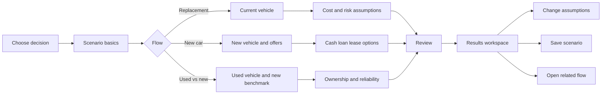

# Multi-flow UX and input design

## 1. Product decision

Use one scenario workspace with three goal-based entry points. Do not present
users with one large vehicle form. Each flow asks only for inputs that can
change its result, while retaining shared assumptions when the user switches
or compares flows.

| Entry point | User decision | Primary result |
| --- | --- | --- |
| Replace my current car | "Keep it or replace it, and when?" | Optimal replacement age |
| Buy a new car | "Cash, loan, or lease?" | Lowest NPV acquisition path |
| Compare used with new | "Is this used car actually cheaper?" | Reliability-adjusted cost gap |

## 2. Navigation model



The persistent workspace header contains scenario name, currency, save status,
and a `Change decision` action. The stepper contains only the active flow's
steps. Back navigation never discards entered values.

## 3. Shared scenario envelope

Every calculation is stored as a versioned scenario:

| Field | Required | UX control | Decision rule |
| --- | --- | --- | --- |
| Scenario name | Yes | Text | Default from vehicle and goal |
| Analysis date | Yes | Date | Defaults to today; anchors vehicle age and cash flows |
| Currency | Yes | Select | One currency per scenario; no implicit FX conversion |
| Annual distance | Yes | Number + mi/km | Must be positive |
| Analysis horizon | Yes | Year slider + input | 1–30 years |
| Discount rate | Yes | Percentage | Real or nominal, declared explicitly |
| Inflation | Yes | Percentage | Hidden when rates are real |
| Tax treatment | Yes | Toggle + rate | Applied only to taxable investment gains |
| Modeling mode | Yes | Deterministic/stochastic | Stochastic reveals simulation controls |

### Rate convention

The user must choose one internally consistent rate basis:

- **Nominal:** inflate future expenses and discount with the nominal rate.
- **Real:** keep expenses in analysis-date dollars and discount with the real
  rate. Inflation is not separately applied.

The UI blocks calculation when rate bases are mixed.

## 4. Flow specifications

### 4.1 Replacement timing

**Scenario:** A user owns a six-year-old vehicle, has positive equity, and wants
to know whether to keep it for two, four, or six more years.

| Step | Inputs | Progressive disclosure |
| --- | --- | --- |
| Current vehicle | Purchase/in-service date, current mileage, market value, loan payoff | Equity is calculated, never typed twice |
| Depreciation | Forecast method, annual values or annual rate | Advanced curve editor only for custom method |
| Operating costs | Maintenance schedule, annual insurance, registration, fuel/energy | Fuel details collapse into annual operating cost if user chooses simplified mode |
| Reliability | Failure events, probability, repair cost, downtime cost | Probability distributions appear only in stochastic mode |
| Replacement | Candidate replacement price, replacement operating cost, transaction costs | Needed to compare "keep" with "replace now" |
| Capital | Opportunity-cost toggle, return assumptions | Available only when current equity is positive |

**Blocking rules**

1. Loan payoff cannot be negative.
2. Opportunity cost cannot be enabled when market value minus payoff is zero or
   negative.
3. Depreciation forecasts cannot produce a negative vehicle value.
4. Failure probabilities must be between 0 and 1 and non-decreasing when they
   represent cumulative failure probability.

### 4.2 New car acquisition

**Scenario:** A user wants to compare paying cash, financing, and leasing. The
user may have the full purchase amount, only a down payment, or only enough for
lease inception costs. Investment results depend on what the user actually does
with unused cash rather than assuming every avoided payment is invested.

| Step | Inputs | Progressive disclosure |
| --- | --- | --- |
| Vehicle | Asking price, transaction price, taxes, fees, path-specific incentives, holding period, resale forecast | Incentive eligibility and market-value details appear when needed |
| Available capital | Liquid cash, current-vehicle proceeds, maximum monthly vehicle budget | Affordability warnings appear per path without hiding hypothetical comparisons |
| Cash | Cash price adjustments, source of funds, post-purchase saving behavior | Monthly saving controls appear only when surplus cash flow exists |
| Loan | Down payment, APR, term, fees, prepayment, balloon | Balloon input appears only for balloon loans |
| Lease | Due at signing, term, payment, residual/buyout, mileage allowance, disposition fee, end strategy | Renewal assumptions appear when the analysis extends past the lease term |
| Ownership costs | Insurance by path, maintenance, registration, energy | A shared value can be overridden per path |
| Investment overlay | Return, volatility, tax rate, contribution timing, treatment of monthly surplus | Volatility and simulation count appear only in stochastic mode |

Users may disable loan or lease paths. At least two acquisition paths must
remain enabled for a comparison.

#### Comparison baseline and affordability

- Available capital is an independent household input; it is never inferred from
  the vehicle price.
- Every path starts from the same opening balance sheet. Incentives, trade-in
  proceeds, and unused capital must not disappear from only one path.
- A path that exceeds available cash is marked `Not currently affordable`.
  Users may retain it as a clearly labeled hypothetical comparison.
- Transaction price and vehicle market value are separate. An incentive reduces
  the amount paid but does not define the asset's value. Market-value and
  depreciation defaults are specific to brand, model, age, and mileage, display
  their source and date, and remain editable.
- Loan payments are derived from amount financed, APR, term, and contractual
  fees. A monthly-budget solver may derive an affordable amount financed, but it
  must be presented as a separate planning mode rather than an offer.

#### Saving behavior

Paying cash does not imply that the user will invest an amount equal to a loan
or lease payment. For each positive monthly cash-flow difference, users choose:

1. Invest all of it automatically.
2. Invest a custom amount or percentage.
3. Retain it as cash.
4. Treat it as spent and unavailable at the horizon.

The default is explicit and editable. Results distinguish **economic potential**
(the surplus is invested consistently) from **behavior-adjusted outcome** (the
user's selected behavior). Recommendations state the required behavior, such as
"Cash leads only if at least $310 per month is invested."

An optional common-budget comparison invests the difference between the budget
and each path's actual monthly outflow. It never changes or conceals the
contractual payment.

#### Multi-vehicle horizon and branch points

An analysis horizon, especially a three-to-nine-year horizon, may contain more
than one vehicle. The model creates explicit decisions at lease maturity, loan
payoff, and user-selected replacement ages.

- Lease maturity: return and lease again, buy out with cash, finance the buyout,
  buy another new or used vehicle, or extend the lease when offered.
- Owned vehicle: keep it, sell or trade it, or replace it with a new or used
  vehicle using cash or financing.
- A subsequent vehicle or lease has independent price, incentive, rate, payment,
  tax, fee, market-value, and operating-cost assumptions. The first offer is
  never silently reused.

Strategy presets such as `Lease every 3 years`, `Buy and keep`, and `Replace
after payoff` keep the primary UI manageable. Advanced users may customize
individual branch decisions. The UI may warn when an ownership duration is
unusual for the selected vehicle, but it does not force replacement.

#### Taxes and incentives

Tax treatment is jurisdiction- and path-specific. Purchase paths may owe sales
tax on the whole taxable transaction, while leases may tax each payment, charge
tax up front, or tax a broader amount depending on the jurisdiction. Lease
buyouts can create a separate taxable transaction and additional fees.

Incentives declare eligibility, applicable acquisition paths, timing, and tax
treatment. A purchase incentive is not assumed to apply to a lease; a lessor
credit passed through as a lower lease cost is recorded as a lease-specific
incentive. Missing jurisdiction rules produce a visible warning and excluded-cost
entry rather than silently assuming zero tax.

**Cash-flow convention**

- Time zero includes available capital, down payment, due-at-signing amounts,
  taxes, fees, incentives, and initial investment.
- Monthly payments occur at period end unless marked "paid in advance."
- Resale value, lease disposition, and investment liquidation occur at the end
  of the selected holding period.
- Refundable lease deposits are cash outflows at inception and inflows at
  return.
- Month zero and month one are distinct. Each recurring payment or contribution
  is posted exactly once, and resale/depreciation endpoints use the exact number
  of elapsed months.
- Chained ownership segments share one boundary event; a lease-maturity or
  replacement month is not duplicated.
- A repeated lease includes its new due-at-signing amount, payment, incentives,
  taxes, and fees. Any amount above a common monthly budget reduces cash or
  investment explicitly.

### 4.3 Used versus new

**Scenario:** A user is comparing a four-year-old vehicle with a current model
and needs repair risk included rather than hidden in an average maintenance
number.

| Step | Inputs | Progressive disclosure |
| --- | --- | --- |
| Used vehicle | Price, model year, mileage, inspection/reconditioning, taxes/fees | Prior damage and warranty fields are optional advanced inputs |
| New benchmark | Price, incentives, taxes/fees, depreciation forecast | Can import a saved new-car scenario |
| Financing | Separate cash/loan terms for each vehicle | Shared loan defaults can be overridden |
| Ownership costs | Insurance, maintenance schedule, registration, energy for each | Difference view is the default |
| Reliability | Failure events, repair cost, probability, downtime | Distribution inputs appear only in stochastic mode |
| Exit assumptions | Holding period and resale forecast for both | Warn when forecast ages exceed available curve data |

The result must show both the raw ownership-cost gap and the
reliability-adjusted gap. Reliability cost is never silently folded into
maintenance.

Both vehicles support cash and loan comparisons using the same available-capital
baseline, cash-flow timing, and saving-behavior rules as the new-car flow. A
used-car cash path is not assumed affordable merely because it is cheaper, and a
loan path retains all unused capital in the selected cash or investment account.

## 5. Input interaction patterns

### Units and timing

- Store money in major currency units and rates as decimals (`0.07`, not `7`).
- Store terms in months and distance in the scenario's selected unit.
- Every recurring cost declares a frequency.
- Every future value declares the period in which it occurs.
- Convert display units at the boundary; calculations use the stored values.

### Defaults

Defaults must be visible and attributable:

| Default type | Display treatment |
| --- | --- |
| User-entered | Normal label |
| Derived | "Calculated" badge with formula tooltip |
| Market assumption | Source/date badge |
| Product default | "Estimate" badge and one-click edit |

Never treat a zero value as "not provided." Optional numeric fields use `null`
or are omitted.

### Validation

Validation has three levels:

1. **Field:** invalid ranges, missing units, impossible dates.
2. **Cross-field:** payoff exceeds value, lease mileage conflict, holding period
   exceeds lease term without a buyout.
3. **Model readiness:** insufficient depreciation years, no comparable paths,
   or stochastic mode without distributions.

Field errors are immediate. Cross-field errors appear after blur and in the
step summary. Model-readiness errors block `Calculate` and link directly to the
input that needs attention.

## 6. Review and results workspace

The review screen is a calculation manifest, not another form. It groups:

- vehicle facts;
- path-specific cash flows;
- shared economic assumptions;
- available-capital and saving-behavior assumptions;
- replacement and lease-end decisions;
- derived values;
- warnings and excluded costs.

Each group has an `Edit` action that returns to the originating step.

The results workspace uses the same four-region layout for all flows:

| Region | Content |
| --- | --- |
| Decision | Recommended acquisition strategy and replacement sequence, cost gap, confidence indicator |
| Economics | NPV, equivalent annual cost, actual monthly cash flow, terminal net worth |
| Timeline | Cost curve, vehicle transitions, and event markers |
| Uncertainty | Sensitivity tornado; percentile bands in stochastic mode |

**Net present value (NPV)** converts every path's future payment, tax, fee,
incentive, and terminal proceeds to analysis-date dollars using the declared
discount rate. The decision view compares present-value cost, where a lower cost
is better. **Terminal net worth** separately reports vehicle equity plus
investment and retained-cash balances minus outstanding debt at the selected
horizon.

NPV and terminal net worth are complementary views and are never combined into
one number. If investment opportunity cost is represented by the NPV discount
rate, the calculation does not also add the same hypothetical investment return
to NPV. The calculation manifest states which method drives the recommendation.

Recommendations include the winning condition: for example, "Loan is cheaper
than cash by $2,480 NPV if after-tax investment return remains above 4.8%."
When saving behavior changes the winner, the result shows both outcomes and the
monthly saving amount or rate required to reach the economic-potential result.

## 7. Cross-flow handoffs

Users can branch without re-entry:

- Replacement result -> `Compare replacement vehicle`: carries replacement
  price and timing into the new-car flow.
- New-car result -> `Compare a used alternative`: carries horizon, economic
  assumptions, and new vehicle as benchmark.
- Used-vs-new result -> `Find replacement timing`: carries the selected vehicle
  and its forecast into the replacement flow.

Handoffs create a new scenario with `sourceScenarioId`; they never mutate the
source calculation.

## 8. Canonical state model

`schemas/calculator-input.schema.json` is the source of truth for persisted and
API-bound inputs. UI-only state such as expanded panels, field focus, and chart
selection must not be stored in the calculation payload.

The current `1.0.0` schema represents a single-vehicle baseline. Before
multi-period strategy calculations are implemented, a versioned schema revision
must encode available capital, saving behavior, path-specific incentive and tax
treatment, lease-end strategy, and subsequent vehicle/offer assumptions. Saved
single-vehicle scenarios require an explicit migration and must not be silently
interpreted as multi-vehicle strategies.

The `flow` discriminator selects exactly one payload:

```text
replacement-timing -> replacementTiming
new-car-acquisition -> newCarAcquisition
used-vs-new         -> usedVsNew
```

Schema version changes are explicit. Saved scenarios require migrations rather
than permissive parsing or silent defaults.
