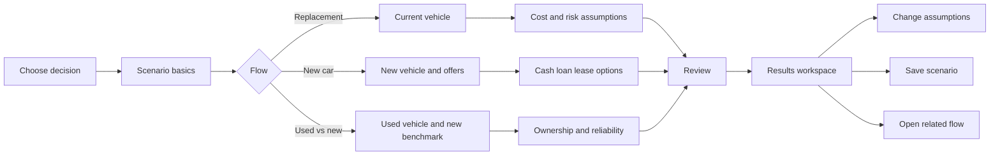

# Multi-flow UX and input design

## 1. Product decision

Use one scenario workspace with three goal-based entry points. Do not present
users with one large vehicle form. Each flow asks only for inputs that can
change its result, while retaining shared assumptions when the user switches
or compares flows.

| Entry point | User decision | Primary result |
| --- | --- | --- |
| Replace my current car | "Keep it or replace it, and when?" | Optimal replacement age |
| Buy a new car | "Cash, loan, or lease?" | Lowest NPV acquisition path |
| Compare used with new | "Is this used car actually cheaper?" | Reliability-adjusted cost gap |

## 2. Navigation model



The persistent workspace header contains scenario name, currency, save status,
and a `Change decision` action. The stepper contains only the active flow's
steps. Back navigation never discards entered values.

## 3. Shared scenario envelope

Every calculation is stored as a versioned scenario:

| Field | Required | UX control | Decision rule |
| --- | --- | --- | --- |
| Scenario name | Yes | Text | Default from vehicle and goal |
| Analysis date | Yes | Date | Defaults to today; anchors vehicle age and cash flows |
| Currency | Yes | Select | One currency per scenario; no implicit FX conversion |
| Annual distance | Yes | Number + mi/km | Must be positive |
| Analysis horizon | Yes | Year slider + input | 1–30 years |
| Discount rate | Yes | Percentage | Real or nominal, declared explicitly |
| Inflation | Yes | Percentage | Hidden when rates are real |
| Tax treatment | Yes | Toggle + rate | Applied only to taxable investment gains |
| Modeling mode | Yes | Deterministic/stochastic | Stochastic reveals simulation controls |

### Rate convention

The user must choose one internally consistent rate basis:

- **Nominal:** inflate future expenses and discount with the nominal rate.
- **Real:** keep expenses in analysis-date dollars and discount with the real
  rate. Inflation is not separately applied.

The UI blocks calculation when rate bases are mixed.

## 4. Flow specifications

### 4.1 Replacement timing

**Scenario:** A user owns a six-year-old vehicle, has positive equity, and wants
to know whether to keep it for two, four, or six more years.

| Step | Inputs | Progressive disclosure |
| --- | --- | --- |
| Current vehicle | Purchase/in-service date, current mileage, market value, loan payoff | Equity is calculated, never typed twice |
| Depreciation | Forecast method, annual values or annual rate | Advanced curve editor only for custom method |
| Operating costs | Maintenance schedule, annual insurance, registration, fuel/energy | Fuel details collapse into annual operating cost if user chooses simplified mode |
| Reliability | Failure events, probability, repair cost, downtime cost | Probability distributions appear only in stochastic mode |
| Replacement | Candidate replacement price, replacement operating cost, transaction costs | Needed to compare "keep" with "replace now" |
| Capital | Opportunity-cost toggle, return assumptions | Available only when current equity is positive |

**Blocking rules**

1. Loan payoff cannot be negative.
2. Opportunity cost cannot be enabled when market value minus payoff is zero or
   negative.
3. Depreciation forecasts cannot produce a negative vehicle value.
4. Failure probabilities must be between 0 and 1 and non-decreasing when they
   represent cumulative failure probability.

### 4.2 New car acquisition

**Scenario:** A user has cash available for a vehicle but wants to compare
paying cash, financing, and leasing while investing unused capital.

| Step | Inputs | Progressive disclosure |
| --- | --- | --- |
| Vehicle | Price, taxes, fees, incentives, holding period, resale forecast | Incentive eligibility details appear when an incentive is entered |
| Cash | Cash price adjustments | Included by default |
| Loan | Down payment, APR, term, fees, prepayment, balloon | Balloon input appears only for balloon loans |
| Lease | Due at signing, term, payment, residual/buyout, mileage allowance, disposition fee | Excess mileage estimate appears when expected mileage exceeds allowance |
| Ownership costs | Insurance by path, maintenance, registration, energy | A shared value can be overridden per path |
| Investment overlay | Starting investable capital, return, volatility, tax rate, contribution timing | Volatility and simulation count appear only in stochastic mode |

Users may disable loan or lease paths. At least two acquisition paths must
remain enabled for a comparison.

**Cash-flow convention**

- Time zero includes down payment, due-at-signing amounts, taxes, fees, and
  initial investment.
- Monthly payments occur at period end unless marked "paid in advance."
- Resale value, lease disposition, and investment liquidation occur at the end
  of the selected holding period.
- Refundable lease deposits are cash outflows at inception and inflows at
  return.

### 4.3 Used versus new

**Scenario:** A user is comparing a four-year-old vehicle with a current model
and needs repair risk included rather than hidden in an average maintenance
number.

| Step | Inputs | Progressive disclosure |
| --- | --- | --- |
| Used vehicle | Price, model year, mileage, inspection/reconditioning, taxes/fees | Prior damage and warranty fields are optional advanced inputs |
| New benchmark | Price, incentives, taxes/fees, depreciation forecast | Can import a saved new-car scenario |
| Financing | Separate cash/loan terms for each vehicle | Shared loan defaults can be overridden |
| Ownership costs | Insurance, maintenance schedule, registration, energy for each | Difference view is the default |
| Reliability | Failure events, repair cost, probability, downtime | Distribution inputs appear only in stochastic mode |
| Exit assumptions | Holding period and resale forecast for both | Warn when forecast ages exceed available curve data |

The result must show both the raw ownership-cost gap and the
reliability-adjusted gap. Reliability cost is never silently folded into
maintenance.

## 5. Input interaction patterns

### Units and timing

- Store money in major currency units and rates as decimals (`0.07`, not `7`).
- Store terms in months and distance in the scenario's selected unit.
- Every recurring cost declares a frequency.
- Every future value declares the period in which it occurs.
- Convert display units at the boundary; calculations use the stored values.

### Defaults

Defaults must be visible and attributable:

| Default type | Display treatment |
| --- | --- |
| User-entered | Normal label |
| Derived | "Calculated" badge with formula tooltip |
| Market assumption | Source/date badge |
| Product default | "Estimate" badge and one-click edit |

Never treat a zero value as "not provided." Optional numeric fields use `null`
or are omitted.

### Validation

Validation has three levels:

1. **Field:** invalid ranges, missing units, impossible dates.
2. **Cross-field:** payoff exceeds value, lease mileage conflict, holding period
   exceeds lease term without a buyout.
3. **Model readiness:** insufficient depreciation years, no comparable paths,
   or stochastic mode without distributions.

Field errors are immediate. Cross-field errors appear after blur and in the
step summary. Model-readiness errors block `Calculate` and link directly to the
input that needs attention.

## 6. Review and results workspace

The review screen is a calculation manifest, not another form. It groups:

- vehicle facts;
- path-specific cash flows;
- shared economic assumptions;
- derived values;
- warnings and excluded costs.

Each group has an `Edit` action that returns to the originating step.

The results workspace uses the same four-region layout for all flows:

| Region | Content |
| --- | --- |
| Decision | Recommended path/time, cost gap, confidence indicator |
| Economics | NPV, equivalent annual cost, monthly cash flow, terminal value |
| Timeline | Cost curve and event markers |
| Uncertainty | Sensitivity tornado; percentile bands in stochastic mode |

Recommendations include the winning condition: for example, "Loan is cheaper
than cash by $2,480 NPV if after-tax investment return remains above 4.8%."

## 7. Cross-flow handoffs

Users can branch without re-entry:

- Replacement result -> `Compare replacement vehicle`: carries replacement
  price and timing into the new-car flow.
- New-car result -> `Compare a used alternative`: carries horizon, economic
  assumptions, and new vehicle as benchmark.
- Used-vs-new result -> `Find replacement timing`: carries the selected vehicle
  and its forecast into the replacement flow.

Handoffs create a new scenario with `sourceScenarioId`; they never mutate the
source calculation.

## 8. Canonical state model

`schemas/calculator-input.schema.json` is the source of truth for persisted and
API-bound inputs. UI-only state such as expanded panels, field focus, and chart
selection must not be stored in the calculation payload.

The `flow` discriminator selects exactly one payload:

```text
replacement-timing -> replacementTiming
new-car-acquisition -> newCarAcquisition
used-vs-new         -> usedVsNew
```

Schema version changes are explicit. Saved scenarios require migrations rather
than permissive parsing or silent defaults.
